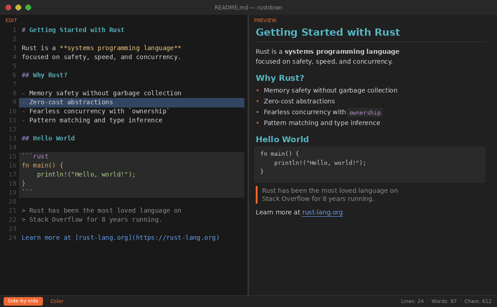
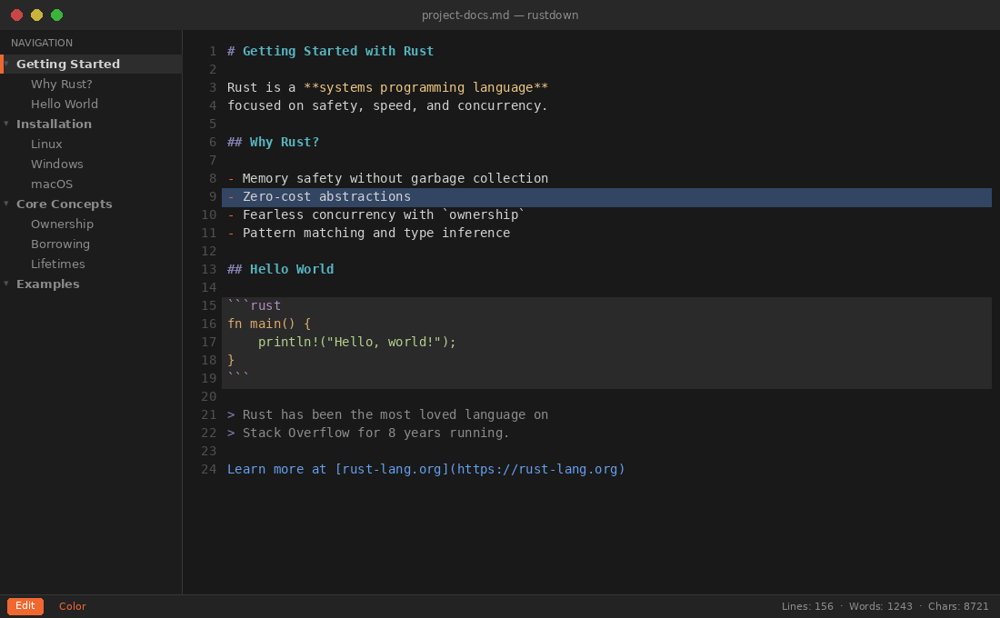

<div align="center">


# rustdown

**A fast, native Markdown editor built in Rust.**

[](https://github.com/teh-hippo/rustdown/actions/workflows/ci.yml)
[](https://github.com/teh-hippo/rustdown/releases/latest)
[](LICENSE)

</div>

<br>

<p align="center">
  
</p>

<br>

## ✨ Features

🖊️ **Edit · Preview · Side-by-side** — three modes, one keystroke to switch\
🎨 **Syntax highlighting** — headings, code fences, bold, links, and more\
📑 **Navigation panel** — jump to any heading instantly\
🔍 **Find & Replace** — search across your document\
📝 **Format on demand** — respects `.editorconfig` (trailing whitespace, final newline, line endings)\
👁️ **Live preview** — full GFM rendering with tables, task lists, strikethrough, and images\
⚡ **Fast** — native GPU-accelerated UI, instant startup, zero Electron\
🔄 **Live reload** — detects external file changes with 3-way merge for dirty buffers\
🖱️ **Drag & drop** — open `.md` files by dropping them in

<br>

<p align="center">
  
</p>

<br>

## 📦 Install

Download a pre-built binary from [**Releases**](https://github.com/teh-hippo/rustdown/releases/latest), or build from source:

```bash
cargo install --git https://github.com/teh-hippo/rustdown.git rustdown
```

<details>
<summary>Linux runtime dependencies</summary>

Most desktop environments already have these. Minimal installs (including WSL) may need:

```bash
sudo apt-get install libwayland-client0 libxkbcommon0 libxkbcommon-x11-0 libgtk-3-0
```

</details>

## 🚀 Usage

```bash
rustdown                    # new document
rustdown README.md          # open a file (starts in Preview mode)
rustdown -s README.md       # open in Side-by-side mode
rustdown -p                 # start in Preview mode
```

## ⌨️ Keyboard Shortcuts

`Ctrl` on Linux/Windows, `Cmd` on macOS.

| Shortcut | Action |
|---|---|
| `Ctrl+O` | Open |
| `Ctrl+S` | Save |
| `Ctrl+Shift+S` | Save As |
| `Ctrl+N` | New document |
| `Ctrl+F` | Find |
| `Ctrl+Shift+F` | Find & Replace |
| `Ctrl+Alt+F` | Format |
| `Ctrl+Enter` | Cycle mode |
| `Ctrl+Shift+T` | Toggle nav panel |
| `Ctrl+Plus/Minus` | Zoom |

## 🖥️ Platforms

| Platform | Architecture | Status |
|---|---|---|
| Linux | x86_64 | ✅ CI |
| Windows | x86_64 | ✅ CI |

## License

[MIT](LICENSE)
