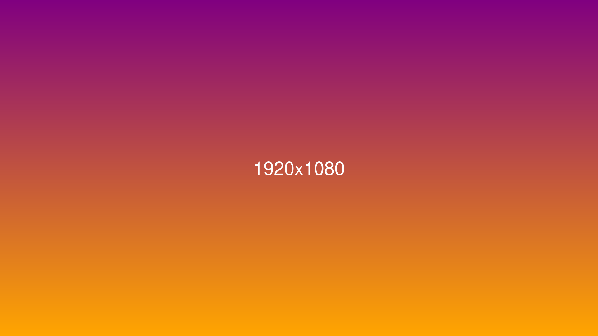

# 🧪 Comprehensive Stress Test Document

This document is designed to push **rustdown** to its limits across rendering, alignment, navigation, and performance.

---

## Heading Colours and Hierarchy

### Level 3: Should Be Coloured

#### Level 4: Different Colour

##### Level 5: Another Shade

###### Level 6: Smallest Heading

Regular paragraph text should **not** be coloured. Only headings get colours.

Back to normal text. Lorem ipsum dolor sit amet, consectetur adipiscing elit.
Sed do eiusmod tempor incididunt ut labore et dolore magna aliqua.

---

## Images — Various Sizes

### Tiny Image (50×50)

Here is a tiny inline image:


Text continues after the tiny image without issues.

### Small Image (200×150)


This paragraph follows a small image. The gap and alignment should be consistent.

### Medium Image (800×400)

This image should be wider than many viewports:


### Large Image (1920×1080)

A full-HD image that will overflow the viewport:



The text here should not be displaced by the large image above.

### Tall Narrow Image (100×800)


This text should appear after the tall narrow image with proper spacing.

### Image That Doesn't Exist


Broken image references should degrade gracefully.

---

## Bullet Lists — Alignment Tests

### Simple Bullets

- First item
- Second item
- Third item with **bold** and *italic*
- Fourth item with `inline code`

### Nested Bullets

- Top level
  - Second level
    - Third level
      - Fourth level
        - Fifth level — how deep can we go?
          - Sixth level
  - Back to second
- Back to top

### Mixed Content Bullets

- A short item
- A much longer item that should wrap across multiple lines in the viewport to test that the bullet dot stays aligned to the first line and doesn't drift down or get misplaced when text wraps. This is intentionally verbose.
- Item with [a link](https://example.com)
- Item with emoji: 🎉🚀✅❌⚠️
- Item with `code` and **bold** and *italic* all mixed together

### Numbered Lists

1. First ordered item
2. Second ordered item
3. Third with **formatting**
4. Fourth with `code`
5. Fifth item
6. Sixth item
7. Seventh item
8. Eighth item
9. Ninth item
10. Tenth item — double digits should align
11. Eleventh item
12. Twelfth item
100. Hundredth — triple digits

### Mixed List Types

1. Ordered parent
   - Unordered child
   - Another child
     1. Nested ordered
     2. Second nested
2. Back to ordered parent
   - Child again
3. Third parent

---

## Tables — Comprehensive Tests

### Simple Table

| Name    | Age | City     |
|---------|-----|----------|
| Alice   | 30  | Sydney   |
| Bob     | 25  | Melbourne|
| Charlie | 35  | Brisbane |

### Table Without Explicit Headers

| Column A | Column B | Column C |
|----------|----------|----------|
| Data 1   | Data 2   | Data 3   |

### Wide Table (Overflow Test)

| ID | Name | Description | Category | Status | Created | Updated | Author | Reviewer | Priority | Tags | Notes |
|----|------|-------------|----------|--------|---------|---------|--------|----------|----------|------|-------|
| 1  | Widget Alpha | A very long description that should test how the table handles overflow text in a single cell without breaking the layout | Hardware | Active | 2025-01-15 | 2025-03-01 | alice@example.com | bob@example.com | High | v1,important,urgent | Needs review before Q2 |
| 2  | Beta Module | Short desc | Software | Draft | 2025-02-01 | 2025-02-28 | charlie | dave | Low | v2 | — |
| 3  | Gamma Service | Medium length description for testing | Backend | Active | 2025-01-20 | 2025-03-04 | eve | frank | Medium | api,service | In progress |

### Table with Empty Rows / Sparse Data

| Feature       | Linux | Windows | macOS |
|---------------|-------|---------|-------|
| File Watching | ✅    | ✅      | ✅    |
| Live Merge    | ✅    | ✅      |       |
| WSL Support   |       | ✅      |       |
|               |       |         |       |
| Export PDF    | ❌    | ❌      | ❌    |

### Table with Code in Cells

| Function | Signature | Returns |
|----------|-----------|---------|
| `parse`  | `fn parse(input: &str) -> Vec<Block>` | `Vec<Block>` |
| `render` | `fn render(ctx: &egui::Context, blocks: &[Block])` | `()` |
| `format` | `fn format(text: &str, config: &Config) -> String` | `String` |

### Minimal Table

| A | B |
|---|---|
| 1 | 2 |

### Single Column Table

| Solo |
|------|
| One  |
| Two  |
| Three|

### Table Immediately After Heading (No Gap)
| Key | Value |
|-----|-------|
| α   | Alpha |
| β   | Beta  |
| γ   | Gamma |

---

## Code Blocks — Various Languages

### Small Code Block

```rust
fn main() {
    println!("Hello, rustdown!");
}
```

### Large Code Block (Vertical Stress)

```python
#!/usr/bin/env python3
"""
A deliberately long code block to test vertical rendering.
This should handle syntax highlighting and scrolling.
"""

import os
import sys
import json
from pathlib import Path
from typing import Dict, List, Optional
from dataclasses import dataclass, field

@dataclass
class Config:
    """Application configuration."""
    name: str
    version: str = "1.0.0"
    debug: bool = False
    features: List[str] = field(default_factory=list)
    metadata: Dict[str, str] = field(default_factory=dict)

    def is_enabled(self, feature: str) -> bool:
        return feature in self.features

    def add_feature(self, feature: str) -> None:
        if feature not in self.features:
            self.features.append(feature)

    def remove_feature(self, feature: str) -> None:
        self.features = [f for f in self.features if f != feature]


def load_config(path: Path) -> Optional[Config]:
    """Load configuration from a JSON file."""
    if not path.exists():
        return None
    try:
        with open(path, 'r', encoding='utf-8') as f:
            data = json.load(f)
        return Config(**data)
    except (json.JSONDecodeError, TypeError, KeyError) as e:
        print(f"Error loading config: {e}", file=sys.stderr)
        return None


def save_config(config: Config, path: Path) -> bool:
    """Save configuration to a JSON file."""
    try:
        path.parent.mkdir(parents=True, exist_ok=True)
        with open(path, 'w', encoding='utf-8') as f:
            json.dump({
                'name': config.name,
                'version': config.version,
                'debug': config.debug,
                'features': config.features,
                'metadata': config.metadata,
            }, f, indent=2)
        return True
    except OSError as e:
        print(f"Error saving config: {e}", file=sys.stderr)
        return False


class Application:
    """Main application class."""

    def __init__(self, config: Config):
        self.config = config
        self._running = False
        self._handlers = {}

    def register_handler(self, event: str, handler):
        self._handlers.setdefault(event, []).append(handler)

    def emit(self, event: str, *args, **kwargs):
        for handler in self._handlers.get(event, []):
            handler(*args, **kwargs)

    def run(self):
        self._running = True
        self.emit('start')
        try:
            while self._running:
                self.emit('tick')
        except KeyboardInterrupt:
            pass
        finally:
            self._running = False
            self.emit('stop')

    def stop(self):
        self._running = False


if __name__ == '__main__':
    config = load_config(Path('config.json'))
    if config is None:
        config = Config(name="MyApp", features=["logging", "metrics"])
        save_config(config, Path('config.json'))

    app = Application(config)
    app.register_handler('start', lambda: print("Starting..."))
    app.register_handler('stop', lambda: print("Stopped."))
    app.run()
```

### Code in Heading

## The `render()` Function Pipeline

### Inline Code Everywhere

Here is `inline code` in a sentence. And `another one`. And a longer one: `fn my_very_long_function_name(param1: &str, param2: u64) -> Result<Vec<u8>, Error>`.

---

## Unicode & Special Characters

### Emoji Stress Test

🎨 Colour palette 🖌️ Paint brush ✏️ Pencil ✎ Writing
📝 Memo 📄 Document 📁 Folder 🗑️ Trash
✅ Check ❌ Cross ⚠️ Warning ℹ️ Info
🔴 Red 🟠 Orange 🟡 Yellow 🟢 Green 🔵 Blue 🟣 Purple
🚀 Rocket 💡 Lightbulb 🔧 Wrench ⚙️ Gear 🔑 Key 🔒 Lock

### Mathematical Symbols

The equation: ∑(i=1 to n) of xᵢ² = α·β + γ/δ ± ε

∀x ∈ ℝ, ∃y : x² + y² = r²

∫₀^∞ e^(-x²) dx = √π/2

Matrices: ⟨a|b⟩ = δᵢⱼ

### CJK Characters

日本語テスト (Japanese test)
中文测试 (Chinese test)
한국어 테스트 (Korean test)

### RTL Characters

بسم الله الرحمن الرحيم (Arabic)
שלום עולם (Hebrew)

### Box Drawing and Special

┌─────────────────┐
│  Box Drawing     │
│  Characters      │
├─────────────────┤
│  ▲ △ ▼ ▽ ◀ ◁   │
│  ▶ ▷ ◆ ◇ ○ ●   │
│  ★ ☆ ♠ ♣ ♥ ♦   │
└─────────────────┘

### Zero-Width and Edge Cases

Here is a zero‌width‌joiner (ZWJ) test.
Here is a soft­hyphen test.
Here is a non breaking space test.
Tab	separated	values	here.

---

## Blockquotes

> Simple blockquote with some text.

> **Bold** in a blockquote with `code` too.
>
> Multiple paragraphs in the same blockquote.
>
> > Nested blockquote
> > > Triple nested
>
> Back to single level.

---

## Horizontal Rules

Above the rule.

---

Below one rule, above another.

***

Between asterisk rules.

___

After underscore rule.

---

## Links

### Inline Links

Visit [example.com](https://example.com) for more info.
A [link with **bold**](https://example.com) text.
A [link with `code`](https://example.com) in it.

### Bare URLs

https://example.com/very/long/path/that/should/wrap/or/handle/overflow/gracefully/in/the/renderer

### Reference Links

[Reference link][ref1] and [another one][ref2].

[ref1]: https://example.com "Example"
[ref2]: https://rust-lang.org "Rust"

---

## Deep Navigation Test

### Section A

#### Subsection A.1

##### Detail A.1.1

Content under A.1.1

##### Detail A.1.2

Content under A.1.2

#### Subsection A.2

Content under A.2

### Section B

#### Subsection B.1

##### Detail B.1.1

###### Micro B.1.1.1

Content at the deepest level.

###### Micro B.1.1.2

More deep content.

##### Detail B.1.2

#### Subsection B.2

### Section C

This section tests that navigation scrolling works all the way to the end of a document.

---

## Stress: Rapid Content Changes

### Long Paragraph

Lorem ipsum dolor sit amet, consectetur adipiscing elit. Sed do eiusmod tempor incididunt ut labore et dolore magna aliqua. Ut enim ad minim veniam, quis nostrud exercitation ullamco laboris nisi ut aliquip ex ea commodo consequat. Duis aute irure dolor in reprehenderit in voluptate velit esse cillum dolore eu fugiat nulla pariatur. Excepteur sint occaecat cupidatat non proident, sunt in culpa qui officia deserunt mollit anim id est laborum. Curabitur pretium tincidunt lacus. Nulla gravida orci a odio. Nullam varius, turpis et commodo pharetra, est eros bibendum elit, nec luctus magna felis sollicitudin mauris. Integer in mauris eu nibh euismod gravida. Duis ac tellus et risus vulputate vehicula. Donec lobortis risus a elit. Etiam tempor. Ut ullamcorper, ligula ut dictum pharetra, nisi nunc fringilla magna, in commodo elit erat nec turpis. Ut pharetra augue nec augue. Nam elit agna, endrerit sit amet, tincidunt ac, viverra sed, nulla. Donec porta diam eu massa.

### Repeated Sections for Scroll Testing

#### Scroll Test Block 1

This is block 1 of 10. Each block adds content to make the document tall enough to require significant scrolling.

Paragraph two of block 1. The quick brown fox jumps over the lazy dog.

#### Scroll Test Block 2

This is block 2 of 10. Content continues to build up vertical space.

#### Scroll Test Block 3

This is block 3 of 10. More content for scrolling tests.

#### Scroll Test Block 4

This is block 4 of 10. The renderer should handle this smoothly.

#### Scroll Test Block 5

This is block 5 of 10. Halfway through the scroll test sections.

- Bullet in scroll block 5
- Another bullet
- Third bullet

#### Scroll Test Block 6

This is block 6 of 10. Tables in scroll sections:

| Block | Status |
|-------|--------|
| 1-5   | Done   |
| 6-10  | In progress |

#### Scroll Test Block 7

This is block 7 of 10. Code in scroll section:

```
Simple code block in scroll area.
Line 2.
Line 3.
```

#### Scroll Test Block 8

This is block 8 of 10. Getting close to the end now.

> Blockquote in scroll block 8.

#### Scroll Test Block 9

This is block 9 of 10. Almost there.

#### Scroll Test Block 10

This is block 10 of 10. **End of scroll test blocks.**

---

## Edge Cases — Rendering Stress

### Triple-Digit Numbered Lists

97. Item ninety-seven
98. Item ninety-eight
99. Item ninety-nine
100. Item one hundred — the number column must be wide enough
101. Item one hundred and one
102. Item one hundred and two

### Task Lists

- [x] Completed task with a checkmark
- [ ] Incomplete task with an empty box
- [x] Another done item
- [ ] Still to do
  - [x] Nested completed sub-task
  - [ ] Nested incomplete

### Deeply Nested Blockquotes

> Level 1
> > Level 2
> > > Level 3 — content should still be readable and not squished
> > > > Level 4 — testing proportional margins at depth
> > > >
> > > > Still at level 4. This should wrap properly even with reduced width.

### Adjacent Tables

| A | B |
|---|---|
| 1 | 2 |

| X | Y | Z |
|---|---|---|
| a | b | c |

### Table Immediately After Paragraph
This is a paragraph followed immediately by a table with no blank line separation.
| Col | Val |
|-----|-----|
| one | two |

### Single-Cell Table

| Solo |
|------|
| Only |

### Code Block With Very Long Lines

```
This is a line that is intentionally made extremely long to test horizontal scrolling in code blocks. It should not wrap by default but instead provide a horizontal scrollbar so the user can scroll to see the full content of the line without it being clipped or overlapping other elements.
Short line.
Another very long line here to ensure the scrollbar appears consistently and remains functional across multiple long lines within the same fenced code block.
```

### Empty Code Block

```
```

### Inline Formatting Stress

This sentence has **bold**, *italic*, ***bold-italic***, `code`, ~~strikethrough~~, [link](https://example.com), and **`bold code`** all in one line.

**Everything bold**: this paragraph is entirely bold formatted, which should not affect line spacing or paragraph alignment compared to normal text.

### Images Side-by-Side Test

 Inline text after tiny image.


Text between images.


---

## Autolinks and Smart Punctuation

### Bare URL Auto-linking

This bare URL should become a link: https://example.com/test

Another URL in a sentence: Visit https://github.com for code.

### Smart Punctuation

"Double smart quotes" and 'single smart quotes' should render correctly.

Em dash---like this---and en dash--like this.

Ellipsis... should be a single character.

---

## Setext Headings

This Is A Setext H1
====================

This Is A Setext H2
--------------------

Text after setext headings should render normally.

---

## Indented Code Block

    This is an indented code block.
    It uses 4 spaces instead of fences.
    Each line should be monospace.

Text after indented code block.

---

## Escaped Characters

\# Not a heading

\* Not a bullet

\> Not a blockquote

\`Not code\`

\[Not a link\](url)

---

## Adjacent Blockquotes

> First blockquote.

> Second blockquote immediately after.

> Third blockquote with **bold** and `code`.

---

## Very Deeply Nested Lists

- Level 1
  - Level 2
    - Level 3
      - Level 4
        - Level 5
          - Level 6
            - Level 7
              - Level 8

---

## Multiple Blank Lines Test


Above had 3 blank lines (only 1 paragraph break should render).


This section also has extra blank lines above.

---

## Table Immediately After Heading (No Gap)
| Tight | Table |
|-------|-------|
| no    | gap   |

### Empty-Looking Table

| A | B | C |
|---|---|---|
|   |   |   |
|   |   |   |

---

## Final Section

If you've scrolled this far, the document rendering is working well!

The end. 🎉
